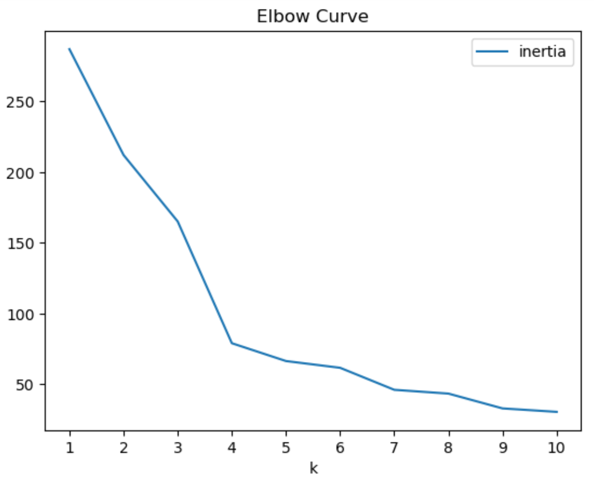
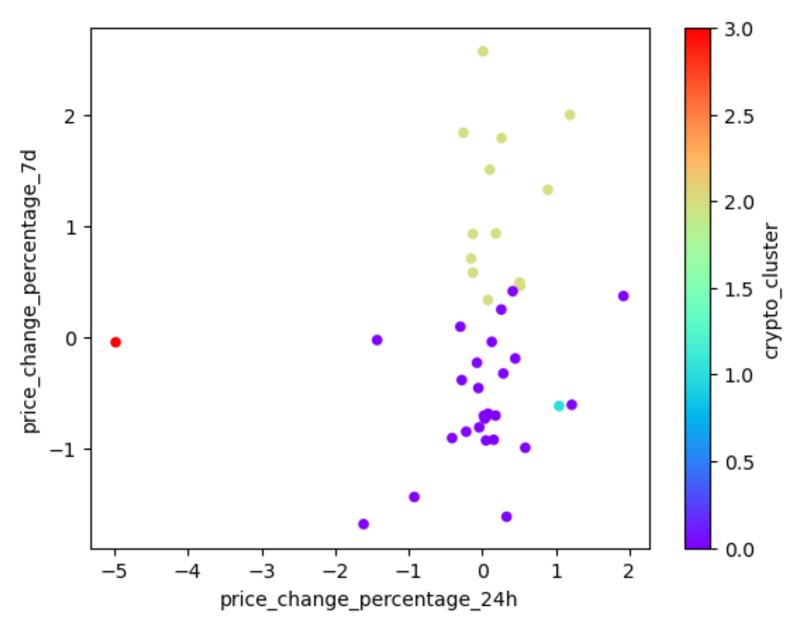
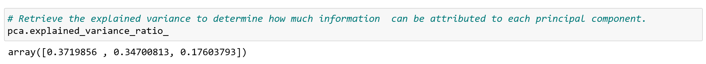
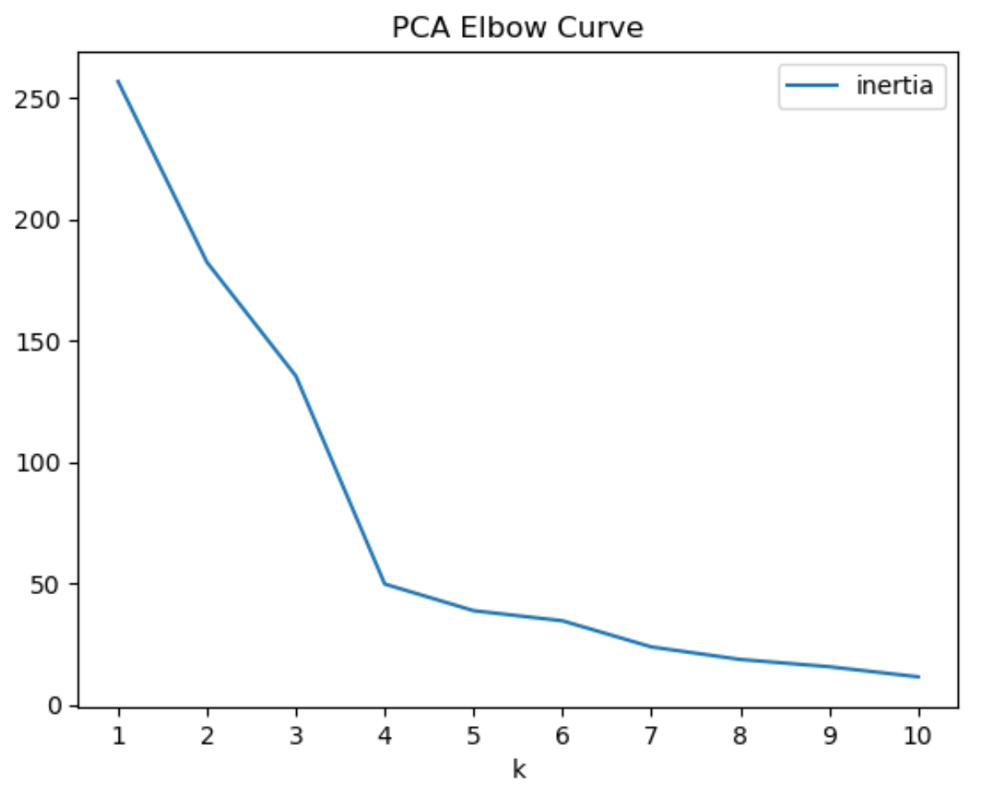
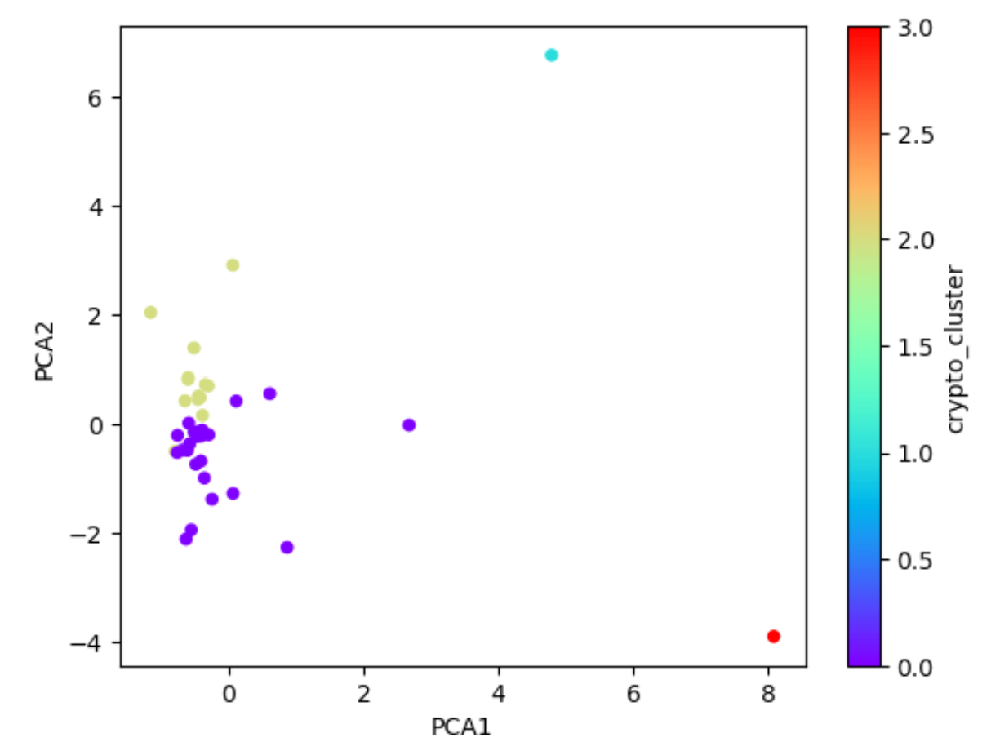
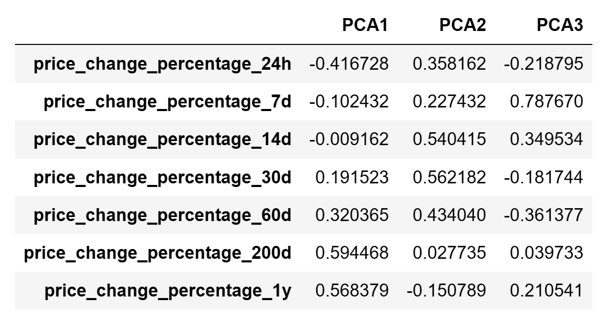

# CryptoClustering
Assignment for AI/ML Bootcamp Module 11 Challenge

---------------------------------------------------------------------

## Description

Our assignment was to apply my understanding of the K-means algorithm and principal component analysis (PCA) to classify cryptocurrencies according to their price fluctuations across various timeframes. Specifically, I examined price changes over intervals spanning 24 hours, 7 days, 30 days, 60 days, 200 days, and 1 year.

This challenge had seven steps:

- Step 1: Prepare the Data
- Step 2: Find the Best Value for k Using the Original Scaled DataFrame
- Step 3: Cluster Cryptocurrencies with K-Means Using the Original Scaled Data
- Step 4: Optimize Clusters with Principal Component Analysis
- Step 5: Find the Best Value for k Using the PCA Data
- Step 6: Cluster Cryptocurrencies with K-Means Using the PCA Data
- Step 7: Determine the Weights of Each Feature on Each Principal Component

## Getting Started

### Dependencies

- Python 3.10
- Jupyter Notebook

### Installing

- Clone this repo to your environment

### Executing program
- Open '**Crypto_Clustering.ipynb**' in Jupyter Notebook
- Step through the notebook to see my data preparation and analysis by clicking the "Run" button.
- The results are displayed after each step.

**Step 1: Prepare the Data**  
1. Used the StandardScaler() module from scikit-learn to normalize the data from the CSV file.
2. Created a DataFrame with the scaled data and set the "coin_id" index from the original DataFrame as the index for the new DataFrame.

**Step 2: Find the Best Value for k Using the Original Scaled DataFrame**  

Used the elbow method to find the best value for k by completing the following steps:

1. Created a list with the number of k values from 1 to 11.
2. Created an empty list to store the inertia values.
3. Created a for loop to compute the inertia with each possible value of k.
4. Created a dictionary with the data to plot the elbow curve.
5. Plotted a line chart with all the inertia values computed with the different values of k to visually identify the optimal value for k.

6. Answered the following question in my notebook: 

> **Question:  What is the best value for k?**
>
> **Answer:  4 - It is where the line bends and starts to flatten out** 
> 

**Step 3: Cluster Cryptocurrencies with K-Means Using the Original Scaled Data**  

Used the following steps to cluster the cryptocurrencies for the best value for k on the original scaled data:

1. Initialized the K-means model with the best value for k.
2. Created an instance of K-means, defined the number of clusters based on the best value of k, and then fit the model using the original scaled DataFrame.
3. Predicted the clusters to group the cryptocurrencies using the original scaled DataFrame.
4. Created a copy of the original data and added a new column with the predicted clusters.
5. Created a scatterplot using pandas’ plot as follows: 
    - Set the x-axis as "price_change_percentage_24h" and the y-axis as "price_change_percentage_7d".

**Step 4: Optimize Clusters with Principal Component Analysis**  

1. Using the original scaled DataFrame, performed a PCA and reduced the features to three principal components. 
2. Retrieved the explained variance to determine how much information can be attributed to each principal component and then answered the following question in my notebook:

> **Question:  What is the total explained variance of the three principal components?**
>
> **Answer:  The total explained variance of the three principal components is .895**
> 

3. Created a new DataFrame with the PCA data and set the "coin_id" index from the original DataFrame as the index for the new DataFrame.

**Step 5: Find the Best Value for k Using the PCA Data**  

Used the elbow method on the PCA data to find the best value for k using the following steps:

1. Created a list with the number of k-values from 1 to 11.
2. Created an empty list to store the inertia values.
3. Created a for loop to compute the inertia with each possible value of k.
4. Created a dictionary with the data to plot the elbow curve.
5. Plotted a line chart with all the inertia values computed with the different values of k to visually identify the optimal value for k.

6. Answered the following questions in my notebook:

> **Question 1:  What is the best value for k when using the PCA data?**
> 
> **Answer:  4 is the best values for 'k' using the PCA data**
>
> **Question 2:  Does it differ from the best k-value found using the original data?**
>
> **Answer:  No, the best 'k' value for both is 4**
>

**Step 6: Cluster Cryptocurrencies with K-Means Using the PCA Data**  

Used the following steps to cluster the cryptocurrencies for the best value for k on the PCA data:

1. Initialized the K-means model with the best value for k.
2. Created an instance of K-means, defined the number of clusters based on the best value of k, and then fit the model using the PCA data.
3. Predicted the clusters to group the cryptocurrencies using the PCA data.
4. Created a copy of the DataFrame with the PCA data and added a new column to store the predicted clusters.
5. Created a scatter plot using pandas’ plot as follows:
    - Set the x-axis as "PC1" and the y-axis as "PC2".

**Step 7: Determine the Weights of Each Feature on Each Principal Component**  

1. Created a DataFrame that shows the weights of each feature (column) for each principal component by using the columns from the original scaled DataFrame as the index.

2. Answered the following question in my notebook:

> **Question:  Which features have the strongest positive or negative influence on each component?**
>
> **Answer:** 
>
>    **Positive Influence:**
>    - price_change_percentage_200d and price_change_percentage_1y have the strongest positive influence on PCA1.
>    - price_change_percentage_30d and price_change_percentage_14d have the strongest positive influence on PCA2.
>    - price_change_percentage_7d has the strongest positive influence on PCA3.
>
>    **Negative Influence:**
>    - price_change_percentage_24h has the strongest negative influence on PCA1. 
>    - price_change_percentage_1y has the strongest negative influence on PCA2. 
>    - price_change_percentage_60d and price_change_percentage_24h have the strongest negative influence on PCA3.
>

## Help

- Please execute all steps in the notebook.  The results of above steps are used in subsequent steps. 

## Authors

- Author:  Tom Clemons

## Version History

- 0.1
    - Initial Release

## Acknowledgments

- None